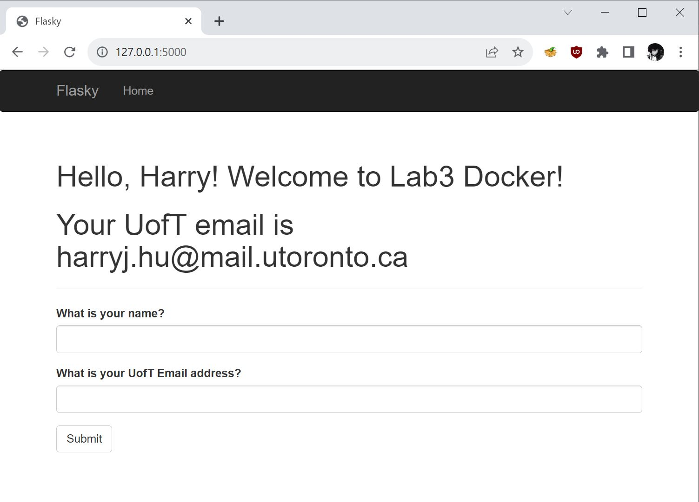
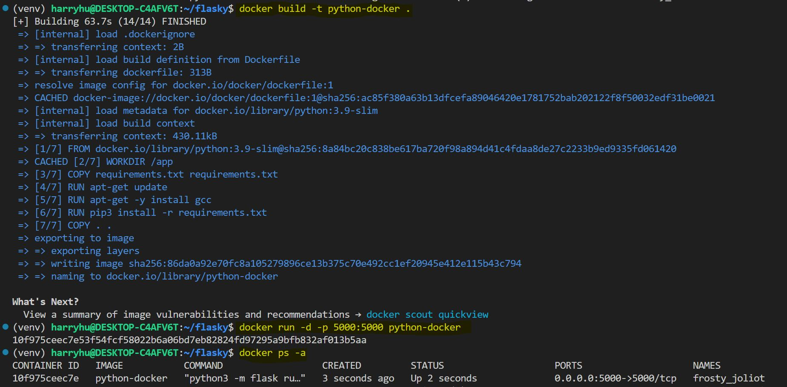
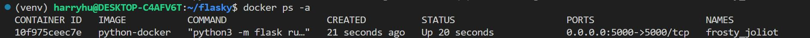
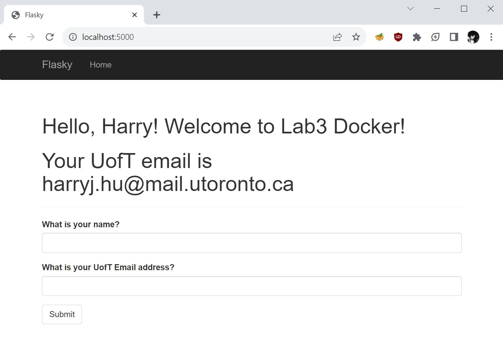

## Harry Jiawei Hu 

This is lab assignment 3 'Docker' which builds on lab assignment 1 'Flask' . In this lab, we learn about the merits and conveniences of docker images, and try to incorporate it with our flask server that we made previously. 

# Activity 1

From the local repository of lab1 flask, a new branch was created for this lab - titled 'lab3'. 
- [x] clearned up README.md on lab 3 branch
- [x] pushed lab3 branch to github 
- [x] set the new branch as default branch 

# Activity 2 

Screenshot of 'Docker Version' in windows command terminal - showing the successful installation of Docker

# Activity 3

Screenshot of the application running locally after changing title to "Hello [your name]! Welcome to Lab3 Docker!". This is to ensure the code base works well before dokerizing it. 

# Activity 4

- Built and ran docker images with the docker commands above 
- Reinstalled python dependencies in Docker through Dockerfile and copying from requirements.txt

Screenshot showing container successfully running. The log information indicates the running application after the 'docker ps -a' command.

Screenshot showing application running on http://localhost:5000 at the time that it was taken. 