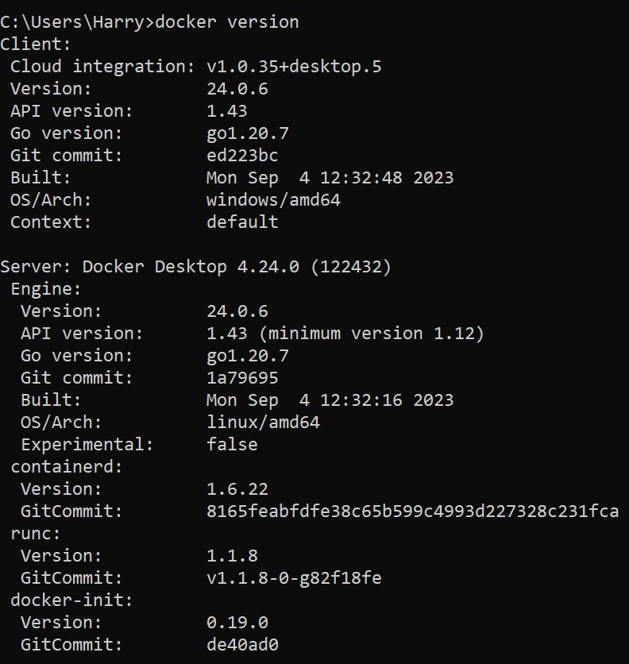

## Harry Jiawei Hu 

This is lab assignment 3 'Docker' which builds on lab assignment 1 'Flask' . In this lab, we learn about the merits and conveniences of docker images, and try to incorporate it with our flask server that we made previously. 

# Activity 1

From the local repository of lab1 flask, a new branch was created for this lab - titled 'lab3'. 
[x] clearned up README.md on lab 3 branch
[x] pushed lab3 branch to github 
[x] set the new branch as default branch 

# Activity 2 

Screenshot of 'Docker Version' in windows command terminal - showing the successful installation of Docker

