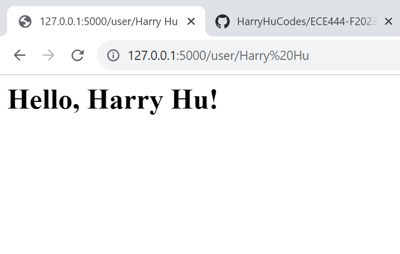
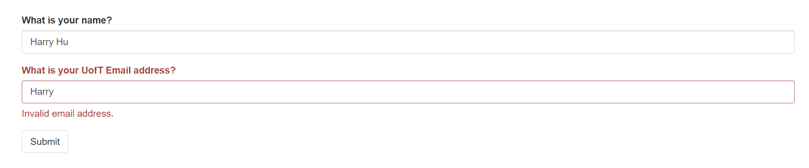

This is the lab 1 assignment for ECE444. In this lab, we aim to develop familiarity with flask by doing a few simple exercises and referring to the open source codes from https://github.com/miguelgrinberg/flask (this is a cloned repo from there). Exercises will be completed from the textbook and used to create our website. 

Harry Jiawei Hu

Activity 1 (Installation of flask)

Screenshot showing the activation of virtual environment (venv) in the directory.  Command ‘pip install flask’ was executed in our venv for the installation of flask and all of its dependencies. This will allow us to keep our projects isolated and clean. Pip freeze displayed a detailed version of all the packages that were installed. Since ‘import flask’ showed no errors, we can conclude that all steps were successful.

Activity 2 (Dynamic Routes)

Screenshot demonstrating successful dynamic route to /user/< name > where client is presented with personalized greeting

Activity 3 (Templates, Context, Bootstrap, Moment)

Screenshot showing the addition of NavBar, dynamic/static route greeting, and timestamp in 'LLLL' format. These were done using templates, flask-bootstrap, and flask-moment. Additionally, custom error pages were added for 401 'Page Not Found' and 500 'Server error' with the help of error handlers that prompts jinja2 to render custom html template files.

Activity 4 (Forms, Sessions, Redirect, Flash, Validation)

Screenshot presenting the basic webpage with 2 fields (name and email) along with a submit button made using Flask-WTF extension.

After a successful submission to the webform with a valid UofT email and an entry for name, the information on the page is then updated with new fields and personalized greeting 

An unsuccessful submission with invalid entry would trigger the following message as a result of validators=[ Email() ]. Similarly, if name field is left empty, we would also get an error due to validators=[ DataRequired() ].

When user enters a valid email that is not from UofT and full name that does not match what was saved in user sessions, we receive the following update to the pages along with 2 flash messages.